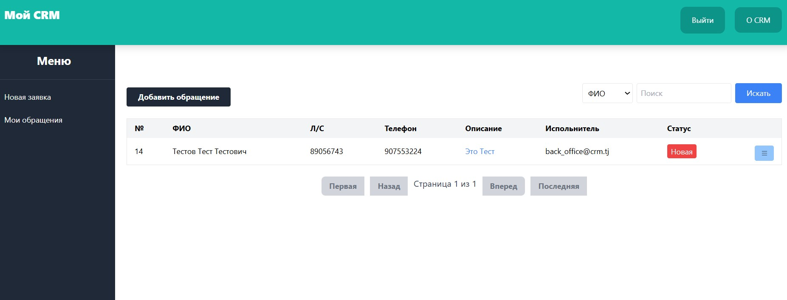
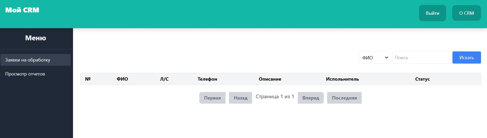
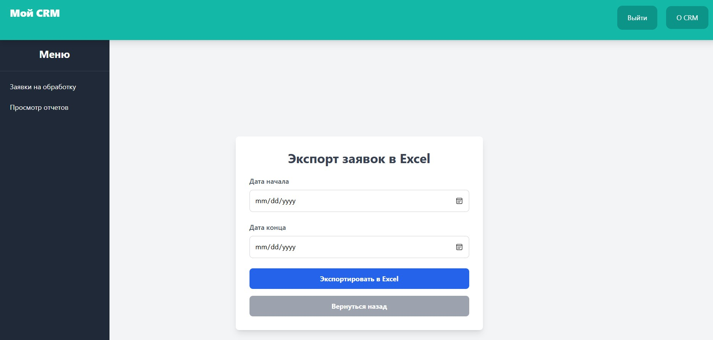
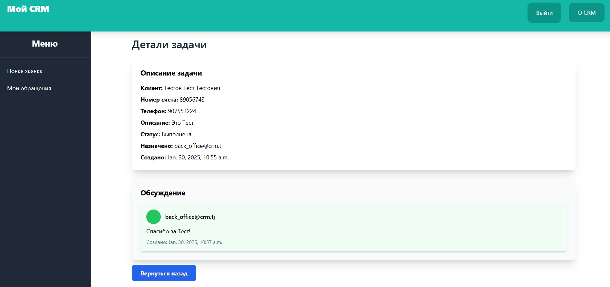

# MY CRM

**MY CRM** — это мини-CRM система, предназначенная для обработки заявок. Операторы могут оставлять заявки, которые затем обрабатываются бэк-офисом. После обработки заявки бэк-офис может решить ее, а оператор может оставить дополнительный комментарий. Система позволяет эффективно управлять заявками и вести диалог между оператором и бэк-офисом.

## Возможности

- Оператор может создавать заявки.
- Бэкоффис имеет возможность просматривать, обрабатывать и решать заявки.
- Оператор и бэкоффис могут обмениваться комментариями в процессе обработки заявки.
- Возможность отслеживания статуса заявки в процессе её решения.

## Требования

Для установки и запуска данного проекта на вашем компьютере необходимо выполнить следующие условия:

- **Python версии 3.12.2 и выше**
- **PostgreSQL** для работы с базой данных.
- **pip** для установки зависимостей.

## Зависимости
- **Через pip установить зависимостей:**
- **Например: pip install django** - все зависимостей можно установит через pip install имя_бибилиотека
- **Django==5.1.5**
- **openpyxl==3.1.5**
- **psycopg2==2.9.10** 
## Установка

1. Клонируйте репозиторий на ваш компьютер:
 
   git clone https://github.com/Sohibnazar/MY_CRM.git
   cd MY_CRM

2. Создайте виртуальное окружение

Для Windows:

python -m venv venv

Для MacOS/Linux:

python3 -m venv venv

3. Активируйте виртуальное окружение

Для Windows:

venv\Scripts\activate

Для MacOS/Linux:

source venv/bin/activate

4. Установите зависимости
pip install -r requirements.txt

5. Настройка базы данных
Откройте файл settings.py и настройте подключение к базе данных PostgreSQL:

DATABASES = {
    'default': {
        'ENGINE': 'django.db.backends.postgresql',
        'NAME': 'ИМЯ_ВАШЕГО_БАЗА_ДАННЫХ',
        'USER': 'ПОЛЬЗОВАТЕЛЬ_ВАШЕГО_БАЗА_ДАННЫХ',
        'PASSWORD': 'ПАРОЛЬ_ВАШЕГО_ПОЛЬЗОВАТЕЛЯ',
        'HOST': '127.0.0.1', **Но ВЫ сможете указать HOST своего сервера**
        'PORT': '5432', **Но ВЫ сможете указать PORT своего сервера**
    }
}
6. Примените миграции
После настройки базы данных, выполните миграции:
**python manage.py makemigrations**

**python manage.py migrate**

7. Создайте суперпользователя

Для доступа к админ-панели Django, создайте суперпользователя:

**python manage.py createsuperuser**

После того когда создал  суперпользователя потом внутри админка создайте две ползователи и назанчте им   ролей : Оператор  и Специалист бэк-офиса.
 
И потом  добавте статус для задачи по порядку сначало:
1 - Новая
2 - Обработается
3 - Решена
4 - Выполнена

8. Запустите сервер разработки

python manage.py runserver

Теперь вы можете открыть проект в браузере по адресу http://127.0.0.1:8000.

Описание функциональности

Оператор:
    Оператор может создавать заявки и передавать их на обработку бэк-офису.
    Оператор может оставить комментарии к заявке после того, как бэк-офис обработает ее.
Бэк-офис:

    Бэк-офис может просматривать заявки, обрабатывать их и принимать решения.
    Бэк-офис может отвечать на комментарии оператора и продолжать работу над заявками.
Структура проекта

MY_CRM/ — основной каталог проекта.
core/ — бизнес-логика и модели данных.
userprofile/ — управление профилями пользователей.

## Изображения сайта как выглядит

## Шаблон для Входа

## Шаблон Главная Страница 

## Шаблон  Страница для Новые заявки Оператора

## Шаблон  Страница для Выполненые заявки Оператора

## Шаблон  Страница для Добавления заявки от Оператора

-------------------------------------

## Шаблон  Страница для Новые заявки Специалист бэк-офиса

## Шаблон  Страница для Решенные заявки Специалист бэк-офиса

## Шаблон  Страница для Выполненые заявки Специалист бэк-офиса

## Шаблон  Страница для выгрузка отчеты заявки Специалист бэк-офиса

## Шаблон  Страница для делалей

<<<<<<< HEAD
 
=======
 
>>>>>>> 1779b63c8f174cd68a9cf68cfd92d99ce0dd6fda
